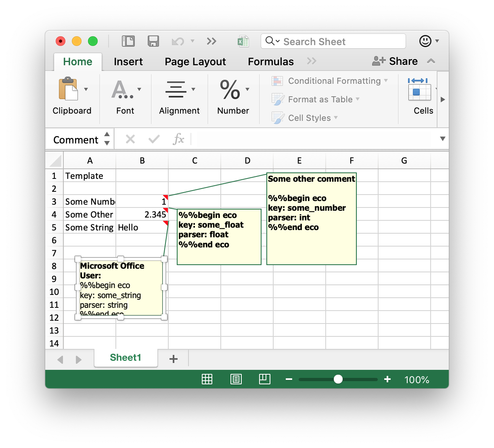

# Exco

[](https://github.com/thegangtechnology/exco/actions?query=workflow%3ABuild)
[](https://github.com/thegangtechnology/exco/actions?query=workflow%3ASonarqube)
[](https://sonarcloud.io/dashboard?id=thegangtechnology_exco)
[](https://github.com/thegangtechnology/exco/actions?query=workflow%3ACodeQL)
[](https://codecov.io/gh/thegangtechnology/exco)
[](https://badge.fury.io/py/exco)

Excel Comment ORM. Declare ORM Spec descriptively right on the excel file.

# What it does

The package allows you to declare orm mapping right in the excel file in the comments
 then use it to extract data from other similar files.
 
An example of a template is shown below.



Dynamic Location, Validation, Assumptions, custom Parser are also supported.


# Installation

```
pip install exco
```

# Simple Usage

```
import exco
processor = exco.from_excel('./quickstart_template.xlsx')
result = processor.process_excel('./quickstart_data_file.xlsx')
print(result.to_dict())
```

See Also [Quick Start Notebook](notebooks/quickstart/0%20Quick%20Start.ipynb)

# Exco Block

Exco relies on yml blocks inside excel comment to build a spec.
Each comment can contain multiple blocks.
There are three types of echo block: a cell block, a table block, and a column block.

## Cell Block

A cellblock is a block of yml that is surrounded by `{{--` and `--}}`
```
{{--
key: some_int
parser: int
--}}
```

This means that parse this cell as `int` and put it in the result with key `some_int`.


Other advance features like, fallback, locator, assumptions, validator are optional.
The full specification is shown below.

```
{{--
key: some_value
# Optional default at_comment_cell
locator: {name: at_comment_cell} 
assumptions: # Optional
    - {key: right_of, name: right_of, label: marker}
parser: int
# Optional
fallback: 7 
# Optional. Dict[name, value].
params: {} 
validators: # Optional
    - {key: between, name: between, low: 5, high: 10 }
--}}
```

### Processing Flow.

The cell processing flow is

1. Locating the Cell
2. Check Assumption
3. Parse
4. Validation

### Features

#### `key`
Key where the result will be put. This is required.

#### `fallback`

This is the most useful one where if the cell is failed locating, testing assumption, parsing.
The fallback value is assumed. If it is not specified, the value None is used. (yml's none is `null`).

#### `locator`
Locator is a dictionary. The key `name` is the class name to be used to locate the cell. Other parameters
can be flattened and put in the same dictionary. These parameters will be pass through the constructor
of such class.

If the locator is left out, it is assumed to be `at_comment_cell` which locate the cell with exactly
the same coordinate as the commented cell in the template.

#### `assumptions`
List of dictionaries. The `key` is the name of the check. `name` is the name of the class to be used in
testing an assumption. Other parameters can be flattened and included in the same dictionary.

#### `parser`
Required. Name of the parser class.

#### `params`
Optional. Dictionary of the parameter name to its value. The spread values are passed through the parser
constructor.

#### `validations`
Optional. List of Dictionary. Each dictionary must have `key` for the validation key and `name`,
validator's class name, specified. Other parameters to be passed to the validator constructor can be flattened and specified in this dictionary as well.

## Table Block
A table block is for specifying the properties of the table. The table block is surrounded by
`{{--table` and `--}}`. The simplest table block is
```
{{--
key: some_table
--}}
```
This is typically what you need. A more complicated example is shown below:

```
{{--table
key: some_table
# optional. default at_comment_cell
locator: {name: at_comment_cell}
# optional. default downward
item_direction: downward
end_conditions:
    - {name: all_blank}
    - {name: max_row, n: 10, inclusive: true}
--}}
```
### Features
#### `key`
where the table will be put in the result. The output for the table is a list of dictionaries
where the key in the dictionaries is the column name specified in column blocks.

#### `locator`
Optional. Default at_comment_cell. Locator for the table anchor cell. Same as a cell block.

#### `item_direction`
Optional Direction for items in the table. Default downward.

#### `end_conditions`
A list of dictionary specifying each termination condition. The dictionary contains `name` and flattened
parameters.

If any of the end condition is met then the parsing for the table terminates. Depending on the end condition's
class, it may or may not include the matching row.

## Column Block

Column block specifications are very similar to the cell block. The simplest example is shown below.
```
{{--col
table_key: some_table
key: some_col
parser: int
}}
```
The column block is very similar to the cell block. It is the cell block with `table_key` and without
`locator`. The `table_key` tells which table it belongs to. It must match one of the table's `key` defined in the table block.

The position of the column cell when extracting value is computed from the relative position to the table
 block in the template.
 
 All other features like fallback, assumptions, validations are also supported in the same
 fashion as the cell block.

# Built-in Functions

## Locator
### `at_comment_cell`
Locate the cell right at the comment cell's coordinate in the template.

### `right_of`
Locate the cell to the right of the cell with the given label.

Parameters:
- `label` label to match.

### `right_of_regex`
Locate the cell to the right of the cell with a regex match.

Parameters:
- `regex` string for the regular expression.

## Assumption

### `left_cell_match`
This is useful in batch processing allowing us to check that we have the correct label to the left.

Parameters:

- `label` string to check that it matches.

## Parser
### `string`
parse value as string.

### `int`
parse the value as an integer. 

### `float`
parse the value as float

### `date`
parser the value as a date.

## Validator

### `between`
valid if the value is between(inclusively) `high` and `low`

#### Parameters

- `high` upper bound value.
- `low` lower bound value

## TableEndCondition

### `all_blank`
Evaluate to true of all columns are blank.

### `max_row`
Evaluate to true if the row number(start from 1) including the parsing row is greater than or
equal to `n`.

#### Parameters
- `n` number of row
- `inclusive` Optional. Default True. Whether to include the row in which it evaluates to true.

# Dereferencing
There are two types of dereferencing
- Spec Creation time dereferencing. The string similar to ``<<A1>>`` will be resolved 
to the value at A1 of the template file.
- Extraction time dereferencing. This string similar to ``==A1==`` will be resolved
to the value at A1 of the extracted file.

Here is an example
```
{{--
key: ==D2==
assumptions: # Optional
    - {key: right_of, name: right_of, label: <<A1>>}
parser: int
fallback: ==D3== 
--}}
```
